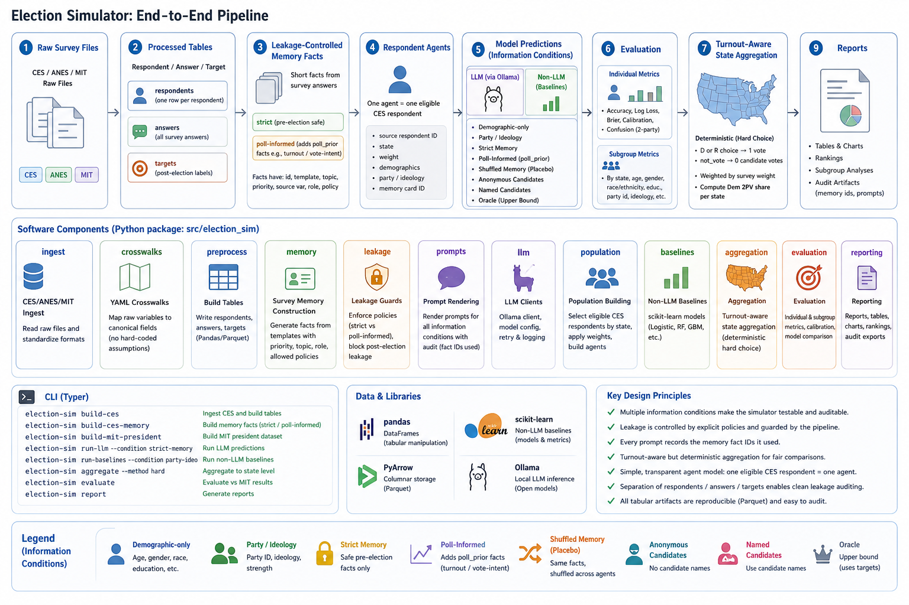

# LM Voting Simulator

This repository builds auditable large-language-model and baseline simulations
for U.S. election behavior. The current research mainline is the 2024 CES
respondent-level presidential turnout + vote pipeline with MIT Election Lab
aggregate evaluation.

The system is intentionally file-based:

```text
raw ANES/CES/MIT files
-> processed parquet artifacts
-> leakage-controlled survey memory
-> respondent agents
-> LLM and non-LLM predictions
-> individual/subgroup metrics
-> turnout-aware state aggregation
-> MIT official-result comparison
-> Markdown reports
```



The diagram shows the same batch workflow visually: local raw survey and
election files are converted into processed artifacts, leakage-controlled
memory, respondent agents, model predictions, evaluation tables, and reports.

Real raw data and generated outputs are local only and are ignored by Git.

## Setup

Create a dedicated Python environment for this project:

```bash
mamba create -y -n voting_simulator python=3.11 pip
conda run -n voting_simulator python -m pip install -r requirements.txt
conda run -n voting_simulator python -m pip install -e .
conda run -n voting_simulator python --version
conda run -n voting_simulator python -m pytest
```

If `mamba` is unavailable, use `conda create -y -n voting_simulator python=3.11 pip`
for the first line.

The current project does not require CUDA-specific Python packages. Local GPU
use, if any, happens through Ollama or another external model server; the Python
pipeline itself uses pandas, pyarrow, scikit-learn, and API clients.

The package uses a `src/` layout plus a repository-local import shim. Editable
install is still recommended so package metadata and reference JSON files are
visible consistently:

```bash
conda run -n voting_simulator python -m election_sim.cli --help
```

## Raw Data

Raw datasets are not committed to this repository. New clones should download
the source files from the official providers, then place them under
`data/raw/...` using the paths expected by the configs.

ANES:

- Citation: American National Election Studies. (2025). ANES 2024 Time Series
  Study Full Release [Dataset and documentation]. August 8, 2025 version.
  https://electionstudies.org/data-center/2024-time-series-study/
- Used for real ANES smoke runs and optional CES persona enrichment. The
  redacted open-ended workbook is needed only for the ANES persona enrichment
  pipeline.

Expected local files:

```text
data/raw/anes/2024/anes_2024.csv
data/raw/anes/2024/anes_timeseries_2024_redactedopenends.xlsx
data/raw/anes/2024/anes_2024_questionnaire.pdf
```

CES:

- Citation: Ansolabehere, Stephen, Brian F. Schaffner, and Jeremy Pope.
  Cooperative Election Study, 2024: Common Content [Computer File]. Release 2:
  August 18, 2025. Cambridge, MA: Harvard University [producer].
  http://cces.gov.harvard.edu
- Used as the main respondent-level microdata source. CES respondents become
  the simulated agents in the main 2024 presidential turnout + vote pipeline.

Expected local files:

```text
data/raw/ces/CES_2024.csv
data/raw/ces/CCES24_Common_pre.docx
data/raw/ces/CCES24_Common_post.docx
data/raw/ces/CES_2024_GUIDE_vv.pdf
```

MIT Election Data:

- Citation: MIT Election Data and Science Lab. (2018/2025). County Presidential
  Election Returns 2000-2024. Harvard Dataverse.
  https://doi.org/10.7910/DVN/VOQCHQ
- Used as official aggregate election truth. The main CES simulation evaluates
  state-level aggregate predictions against processed MIT truth; MIT data is
  not mapped back onto individual CES respondents.

>NOTE: The official website lacks aggregated data for 2024; you will need to perform the calculations yourself using the raw data.

Expected local files:

```text
data/raw/mit/countypres_2000-2024.csv
data/raw/mit/1976-2024-president.csv
```

Runtime pipelines read static YAML mappings in `configs/`; DOCX/PDF manuals are
reference inputs for humans, not parsed during normal runs.

## Main CES + MIT Pipeline

Build CES respondent artifacts:

```bash
conda run -n voting_simulator python -m election_sim.cli build-ces \
  --config configs/datasets/ces_2024_real_vv.yaml \
  --profile-crosswalk configs/crosswalks/ces_2024_profile.yaml \
  --question-crosswalk configs/crosswalks/ces_2024_pre_questions.yaml \
  --target-crosswalk configs/crosswalks/ces_2024_targets.yaml \
  --context-crosswalk configs/crosswalks/ces_2024_context.yaml \
  --out data/processed/ces/2024_common_vv
```

Build strict pre-election memory:

```bash
conda run -n voting_simulator python -m election_sim.cli build-ces-memory \
  --respondents data/processed/ces/2024_common_vv/ces_respondents.parquet \
  --answers data/processed/ces/2024_common_vv/ces_answers.parquet \
  --fact-templates configs/fact_templates/ces_2024_common_facts.yaml \
  --policy strict_pre_no_vote_v1 \
  --out data/processed/ces/2024_common_vv \
  --max-facts 24
```

Build MIT official truth:

```bash
conda run -n voting_simulator python -m election_sim.cli build-mit-president \
  --config configs/datasets/mit_president_returns.yaml
```

Run the seven-state strict pre-election experiment:

```bash
conda run -n voting_simulator python -m election_sim.cli run-simulation \
  --run-config configs/runs/ces_2024_president_swing_strict_pre.yaml
```

The default swing configs use all eligible CES respondents in the selected
states and evaluate against real processed MIT state truth. For fast validation
without running the full row set, use the `_smoke` variants:

```bash
conda run -n voting_simulator python -m election_sim.cli run-simulation \
  --run-config configs/runs/ces_2024_president_swing_strict_pre_smoke.yaml
```

For poll-informed prompts, build a separate memory directory and run:

```bash
conda run -n voting_simulator python -m election_sim.cli build-ces-memory \
  --respondents data/processed/ces/2024_common_vv/ces_respondents.parquet \
  --answers data/processed/ces/2024_common_vv/ces_answers.parquet \
  --fact-templates configs/fact_templates/ces_2024_common_facts.yaml \
  --policy poll_informed_pre_v1 \
  --out data/processed/ces/2024_common_vv_poll \
  --max-facts 24

conda run -n voting_simulator python -m election_sim.cli run-simulation \
  --run-config configs/runs/ces_2024_president_swing_poll_informed.yaml
```

To enrich CES respondents with matched ANES persona context, build an opt-in
memory directory. ANES is used only as a donor pool for inferred persona facts;
MIT remains aggregate evaluation truth only.

```bash
conda run -n voting_simulator python -m election_sim.cli build-ces-anes-persona \
  --ces-respondents data/processed/ces/2024_common_vv/ces_respondents.parquet \
  --ces-answers data/processed/ces/2024_common_vv/ces_answers.parquet \
  --ces-memory-facts data/processed/ces/2024_common_vv/ces_memory_facts.parquet \
  --ces-memory-cards data/processed/ces/2024_common_vv/ces_memory_cards.parquet \
  --anes-raw data/raw/anes/2024/anes_2024.csv \
  --anes-open-ends data/raw/anes/2024/anes_timeseries_2024_redactedopenends.xlsx \
  --config configs/persona/ces_anes_persona_2024.yaml \
  --out data/processed/ces/2024_common_vv_anes_persona

conda run -n voting_simulator python -m election_sim.cli run-simulation \
  --run-config configs/runs/ces_2024_president_anes_persona_smoke.yaml
```

Expected run outputs:

```text
data/runs/<run_id>/
  agents.parquet
  prompts.parquet
  prompt_preview.md
  responses.parquet
  individual_eval_metrics.parquet
  aggregate_state_results.parquet
  aggregate_eval_metrics.parquet
  eval_report.md
```

## Smoke Runs

Fixture end-to-end run:

```bash
conda run -n voting_simulator python -m election_sim.cli run-simulation \
  --run-config configs/runs/first_e2e_2024_pa_fixture.yaml
```

Deterministic CES smoke:

```bash
conda run -n voting_simulator python -m election_sim.cli run-simulation \
  --run-config configs/runs/ces_2024_president_smoke.yaml
```

Tiny real-model CES smoke using local Ollama `qwen3.5:0.8b`:

```bash
conda run -n voting_simulator python -m election_sim.cli run-simulation \
  --run-config configs/runs/ces_2024_president_qwen08b_3_agent.yaml
```

Real ANES 2024 one-agent smoke:

```bash
conda run -n voting_simulator python -m election_sim.cli build-anes \
  --config configs/datasets/anes_2024_real_min.yaml \
  --profile-crosswalk configs/crosswalks/anes_2024_real_min_profile.yaml \
  --question-crosswalk configs/crosswalks/anes_2024_real_min_questions.yaml \
  --out data/processed/anes/2024_real_min

conda run -n voting_simulator python -m election_sim.cli build-anes-memory \
  --respondents data/processed/anes/2024_real_min/anes_respondents.parquet \
  --answers data/processed/anes/2024_real_min/anes_answers.parquet \
  --fact-templates configs/fact_templates/anes_2024_real_min_facts.yaml \
  --policy safe_survey_memory_v1 \
  --out data/processed/anes/2024_real_min \
  --max-facts 6

conda run -n voting_simulator python -m election_sim.cli run-simulation \
  --run-config configs/runs/real_anes_2024_one_agent_ollama.yaml
```

## Leakage Policies

- `strict_pre_no_vote_v1`: excludes post-election turnout/vote, all `TS_*`
  validation fields, and direct pre-election vote intention/preference.
- `poll_informed_pre_v1`: still excludes post-election and TargetSmart fields,
  but allows direct pre-election turnout/vote intention as `poll_prior`.
- `strict_pre_no_vote_with_anes_persona_v1`: strict pre-vote CES memory plus
  whitelisted ANES pre-election inferred persona facts under a separate prompt
  heading.
- `post_hoc_explanation_v1`: explanatory-only; reports mark it as not a formal
  prediction policy.

Policy reference data lives in
`src/election_sim/reference/leakage_policies.json`.

## CES LLM Baselines

CES LLM baselines are separated by information condition:

- `ces_demographic_only_llm`: state, age, gender, race/ethnicity, education.
- `ces_party_ideology_llm`: demographics plus party ID and ideology.
- `ces_survey_memory_llm`: demographics plus party/ideology and strict
  pre-election memory facts.
- `ces_poll_informed_llm`: demographics plus party/ideology, strict memory
  facts, and `poll_prior` facts from poll-informed memory.
- `ces_anes_persona_llm`: strict CES memory plus separately labeled
  ANES-matched inferred persona context.

Older names `demographic_only_llm`, `party_ideology_llm`, and
`survey_memory_llm` remain accepted as aliases for compatibility, but new CES
configs should use the `ces_*_llm` names.

## LLM Providers

Default tests use `model.provider: mock`. Ollama uses `/api/chat` with JSON
format and `think: false`:

```yaml
model:
  provider: ollama
  base_url: http://172.26.48.1:11434
  model_name: qwen3.5:2b
  temperature: 0.0
  response_format: json
```

OpenAI-compatible endpoints use:

```yaml
model:
  provider: openai_compatible
  base_url: https://api.deepseek.com/v1
  api_key_env: DEEPSEEK_API_KEY
  model_name: deepseek-chat
```

## Documentation

Start with [documents/developer_guide.md](documents/developer_guide.md) for the
module map, pipeline contracts, full-chain test plan, and safe modification
guidance.

## Known Limitations

- CES aggregate evaluation is state-level. County MIT truth and historical
  features are generated for future county-aware simulation.
- The `_smoke` swing configs use `100` respondents per state for fast
  validation and should not be used for final conclusions.
- Real LLM providers may produce invalid JSON or malformed probabilities; raw
  responses and parse status are preserved in `responses.parquet` and reports.
