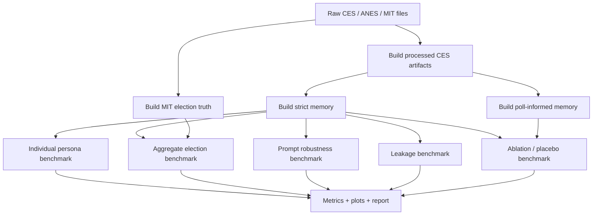

# LM Voting Simulator Evaluation Plan

## 2026-05-01 Contract Amendment: Hard Choice CES Responses

The current CES `president_turnout_vote` response contract is a hard three-way
choice, not a model-written probability estimate. All LLM and non-LLM CES
turnout-vote predictions must emit:

```json
{"choice": "not_vote|democrat|republican"}
```

The system derives compatibility columns from this choice:
`turnout_probability` is `0` for `not_vote` and `1` otherwise;
`vote_prob_democrat` and `vote_prob_republican` are one-hot indicators;
`vote_prob_other`, `vote_prob_undecided`, and `confidence` are retained only for
table compatibility. Metrics and gates that depend on model-written
probability calibration, probability-sum errors, all-zero probability vectors,
JS divergence of vote probabilities, vote log loss, or vote confidence are
deprecated for the hard-choice suite. Preflight gates now check parse success,
invalid choices, forbidden choices, and legacy probability-schema output.

## 0. Purpose

This document defines an executable evaluation suite for the current LM Voting Simulator MVP.

The suite evaluates six capabilities:

1. **Individual persona fidelity**: whether one agent predicts the behavior of its source respondent.
2. **Aggregate election accuracy**: whether the full simulated population reproduces state-level election outcomes.
3. **Prompt robustness**: whether semantically equivalent prompts produce stable outputs.
4. **Historical/world-knowledge leakage**: whether the model is using known 2024 election facts instead of persona information.
5. **Information ablation and placebo memory**: which information sources actually improve prediction.
6. **Subgroup and calibration reliability**: whether performance is stable across demographic and political groups.

All suggested sizes and runtime settings below are defaults for a local laptop GPU setting, roughly:

```yaml
gpu: RTX 5070 Laptop 8GB
model: Qwen3.5-2B or similar small local model
parallelism: 2-3 workers
target_runtime_per_experiment: <= 2 hours
```

Actual sample sizes, workers, model names, and runtime limits should be adjusted according to the local test environment, model latency, memory pressure, and experimental needs.

---

## 1. Evaluation Suite Overview

### 1.1 High-level pipeline



### 1.2 Core output directory

Use one root directory for the evaluation suite:

```text
data/runs/eval_suite_<YYYYMMDD>/
  00_preflight/
  01_individual_persona/
  02_aggregate_accuracy/
  03_prompt_robustness/
  04_leakage/
  05_ablation_placebo/
  06_subgroup_calibration/
  figures/
  tables/
  eval_suite_summary.md
```

Each experiment should write:

```text
responses.parquet
prompts.parquet
agents.parquet
metrics.parquet
state_predictions.parquet       # aggregate / leakage when applicable
runtime.json
config_snapshot.yaml
figures/
report.md
```

---

## 2. Shared Setup

## 2.1 Environment setup

```bash
mamba create -y -n voting_simulator python=3.11 pip
conda run -n voting_simulator python -m pip install -r requirements.txt
conda run -n voting_simulator python -m pip install -e .
conda run -n voting_simulator python -m pytest
```

If `mamba` is unavailable:

```bash
conda create -y -n voting_simulator python=3.11 pip
```

## 2.2 Raw data layout

Expected local data paths:

```text
data/raw/ces/CES_2024.csv
data/raw/ces/CCES24_Common_pre.docx
data/raw/ces/CCES24_Common_post.docx
data/raw/ces/CES_2024_GUIDE_vv.pdf

data/raw/anes/2024/anes_2024.csv
data/raw/anes/2024/anes_timeseries_2024_redactedopenends.xlsx

data/raw/mit/countypres_2000-2024.csv
data/raw/mit/1976-2024-president.csv
data/raw/mit/2024-better-evaluation.csv
```

The DOCX/PDF files are reference files. Runtime pipelines should rely on CSV/parquet/YAML mappings.

## 2.3 Build processed inputs

### CES respondent artifacts

```bash
conda run -n voting_simulator python -m election_sim.cli build-ces \
  --config configs/datasets/ces_2024_real_vv.yaml \
  --profile-crosswalk configs/crosswalks/ces_2024_profile.yaml \
  --question-crosswalk configs/crosswalks/ces_2024_pre_questions.yaml \
  --target-crosswalk configs/crosswalks/ces_2024_targets.yaml \
  --context-crosswalk configs/crosswalks/ces_2024_context.yaml \
  --out data/processed/ces/2024_common_vv
```

Expected outputs:

```text
data/processed/ces/2024_common_vv/
  ces_respondents.parquet
  ces_answers.parquet
  ces_targets.parquet
  ces_context.parquet
  ces_question_bank.parquet
  ces_ingest_report.md
```

### Strict pre-election memory

```bash
conda run -n voting_simulator python -m election_sim.cli build-ces-memory \
  --respondents data/processed/ces/2024_common_vv/ces_respondents.parquet \
  --answers data/processed/ces/2024_common_vv/ces_answers.parquet \
  --fact-templates configs/fact_templates/ces_2024_common_facts.yaml \
  --policy strict_pre_no_vote_v1 \
  --out data/processed/ces/2024_common_vv \
  --max-facts 24
```

Expected outputs:

```text
ces_memory_facts.parquet
ces_memory_cards.parquet
ces_leakage_audit.parquet
```

### Poll-informed memory

```bash
conda run -n voting_simulator python -m election_sim.cli build-ces-memory \
  --respondents data/processed/ces/2024_common_vv/ces_respondents.parquet \
  --answers data/processed/ces/2024_common_vv/ces_answers.parquet \
  --fact-templates configs/fact_templates/ces_2024_common_facts.yaml \
  --policy poll_informed_pre_v1 \
  --out data/processed/ces/2024_common_vv_poll \
  --max-facts 24
```

### MIT election truth

```bash
conda run -n voting_simulator python -m election_sim.cli build-mit-president \
  --config configs/datasets/mit_president_returns.yaml
```

Expected outputs:

```text
data/processed/mit/
  president_state_truth.parquet
  president_county_truth.parquet
  president_historical_features.parquet
  mit_ingest_audit.parquet
  mit_ingest_report.md
```

---

## 3. Shared Model Configuration

Use a central model block and copy it into each experiment config.

```yaml
model:
  provider: ollama
  base_url: http://localhost:11434
  model_name: qwen3.5:2b
  temperature: 0.0
  max_tokens: 300
  response_format: json
  cache_enabled: true

llm:
  workers: 2
  timing_responses: 20
  max_runtime_minutes: 110
```

Adjust:

```yaml
workers: 1-3
timing_responses: 10-40
max_runtime_minutes: 60-120
max_tokens: 200-500
model_name: local model name available in Ollama or target provider
```

Recommended rule:

```text
estimated_minutes = prompt_calls * median_latency_seconds / workers / 60
```

Keep `estimated_minutes <= max_runtime_minutes`.

---

## 4. Shared Evaluation Metrics

## 4.1 Parsing and schema metrics

Every experiment should report:

```text
parse_ok_rate
invalid_json_rate
invalid_schema_rate
invalid_probability_rate
all_zero_vote_probability_rate
mean_probability_sum_error
cache_hit_rate
median_latency_seconds
```

Definitions:

```text
parse_ok_rate = mean(parse_status == "ok")

all_zero_vote_probability_rate =
  mean(vote_prob_democrat == 0
       and vote_prob_republican == 0
       and vote_prob_other == 0
       and vote_prob_undecided == 0)

probability_sum_error =
  abs(vote_prob_democrat
      + vote_prob_republican
      + vote_prob_other
      + vote_prob_undecided
      - 1)
```

Quality gate before scaling up:

```text
parse_ok_rate >= 0.95
all_zero_vote_probability_rate <= 0.02
mean_probability_sum_error <= 0.02
```

These gates are suggested defaults and can be relaxed for early debugging.

## 4.2 Individual turnout metrics

Use target:

```text
turnout_2024_self_report
```

Optional validation target:

```text
turnout_2024_validated
```

Metrics:

```text
turnout_brier
turnout_auc
turnout_accuracy_at_0_5
turnout_ece
```

Formula:

```text
turnout_brier = mean((p_turnout - y_turnout)^2)
```

where:

```text
y_turnout = 1 if voted else 0
```

## 4.3 Individual vote metrics

Use target:

```text
president_vote_2024
```

Classes:

```text
democrat
republican
other
not_vote
```

Metrics:

```text
vote_accuracy
vote_macro_f1
vote_log_loss
multiclass_brier
confusion_matrix
```

Combined class probabilities:

```text
P(democrat)   = turnout_probability * vote_prob_democrat
P(republican) = turnout_probability * vote_prob_republican
P(other)      = turnout_probability * vote_prob_other
P(not_vote)   = 1 - turnout_probability + turnout_probability * vote_prob_undecided
```

Normalize these four probabilities before log loss and Brier calculation.

## 4.4 Aggregate election metrics

For each state:

```text
expected_dem_votes = sum(weight_i * turnout_i * p_dem_i)
expected_rep_votes = sum(weight_i * turnout_i * p_rep_i)
expected_other_votes = sum(weight_i * turnout_i * p_other_i)

dem_share_2p = expected_dem_votes / (expected_dem_votes + expected_rep_votes)
margin_2p = 2 * dem_share_2p - 1
winner = democrat if margin_2p > 0 else republican if margin_2p < 0 else tie
```

Aggregate metrics:

```text
state_dem_2p_rmse
state_margin_mae
winner_accuracy
national_dem_2p_error
state_dem_2p_error
state_margin_error
```

---

# Experiment 00: Preflight and Data Contract Validation

## Purpose

Verify that processed inputs, leakage policies, memory files, and basic model output are valid before running expensive benchmarks.

## Design

Run:

1. CES build.
2. Strict memory build.
3. Poll-informed memory build.
4. MIT truth build.
5. One tiny mock or real-model smoke run.
6. Leakage audit checks.

## Suggested command

```bash
conda run -n voting_simulator python -m pytest

conda run -n voting_simulator python -m election_sim.cli run-simulation \
  --run-config configs/runs/ces_2024_president_swing_strict_pre_smoke.yaml
```

For local real model smoke, use a tiny config with:

```yaml
population:
  sampling:
    mode: stratified_state_sample
    n_agents_per_state: 3

baselines:
  - ces_survey_memory_llm

model:
  provider: ollama
  model_name: qwen3.5:2b
  temperature: 0.0
  response_format: json
```

## Required checks

Strict memory must exclude:

```text
CC24_401
CC24_410
CC24_410_nv
TS_*
CC24_363
CC24_364a
CC24_365
CC24_366
CC24_367
```

Poll-informed memory may include:

```text
CC24_363
CC24_364a
```

but only as:

```text
fact_role = poll_prior
```

Poll-informed memory must still exclude:

```text
CC24_401
CC24_410
CC24_410_nv
TS_*
```

## Outputs

```text
00_preflight/
  preflight_checks.md
  leakage_audit_summary.csv
  smoke_responses.parquet
  smoke_prompt_preview.md
```

## Visualizations

Optional:

```text
bar chart: number of facts by fact_role
bar chart: excluded variables by leakage reason
bar chart: parse_status counts in smoke run
```

## Interpretation

Pass:

```text
strict memory has zero direct vote or post-election leakage
poll-informed memory contains poll_prior only where expected
model returns parseable JSON in smoke run
MIT truth files exist and include 2024 state results
```

Fail:

```text
any target/post-election/TargetSmart variable appears in strict prompt facts
parse_ok_rate is too low for tiny smoke run
probabilities are frequently all-zero or invalid
```

---

# Experiment 01: Individual Persona Fidelity

## Purpose

Measure whether each LLM agent predicts the turnout and presidential vote behavior of its own source CES respondent.

This experiment answers:

```text
Does the agent behave like the specific respondent it represents?
Does strict survey memory improve individual prediction beyond demographics and party ID?
Which respondent groups are poorly simulated?
```

## Design

### Unit of analysis

```text
CES respondent / agent
```

### Suggested sample

Default local run:

```yaml
states: [PA, GA, AZ, WI]
agents_per_state: 25
total_agents: 100
```

Smaller debug run:

```yaml
states: [PA, GA]
agents_per_state: 5
total_agents: 10
```

Larger run:

```yaml
states: [PA, MI, WI, GA, AZ, NV, NC]
agents_per_state: 50
total_agents: 350
```

### Eligibility filters

Use respondents satisfying:

```yaml
tookpost_required: true
citizen_required: true
```

Use post-election weight:

```yaml
weight_column: weight_common_post
```

### LLM conditions

Recommended minimum:

```text
E01_L1_demographic_state_llm
E01_L3_party_ideology_llm
E01_L6_strict_memory_context_llm
```

Optional:

```text
E01_L7_poll_informed_memory_context_llm
```

Do not treat poll-informed as leakage-free. It is an upper-bound condition.

### Non-LLM baselines

Run these whenever possible:

```text
party_id_baseline
sklearn_logit_demographic_only
sklearn_logit_pre_only
sklearn_logit_poll_informed
```

## Suggested config

Create:

```text
configs/benchmarks/e01_individual_persona_local.yaml
```

Suggested content:

```yaml
run_id: e01_individual_persona_local
seed: 20260426

states: [PA, GA, AZ, WI]
agents_per_state: 25

paths:
  run_dir: data/runs/eval_suite_local/01_individual_persona
  ces_respondents: data/processed/ces/2024_common_vv/ces_respondents.parquet
  ces_answers: data/processed/ces/2024_common_vv/ces_answers.parquet
  ces_targets: data/processed/ces/2024_common_vv/ces_targets.parquet
  ces_context: data/processed/ces/2024_common_vv/ces_context.parquet
  strict_memory_facts: data/processed/ces/2024_common_vv/ces_memory_facts.parquet
  strict_memory_cards: data/processed/ces/2024_common_vv/ces_memory_cards.parquet
  poll_memory_facts: data/processed/ces/2024_common_vv_poll/ces_memory_facts.parquet
  poll_memory_cards: data/processed/ces/2024_common_vv_poll/ces_memory_cards.parquet

sampling:
  split: test
  weight_column: weight_common_post
  tookpost_required: true
  citizen_required: true

baselines:
  non_llm:
    - party_id_baseline
    - sklearn_logit_demographic_only
    - sklearn_logit_pre_only
    - sklearn_logit_poll_informed
  llm:
    - E01_L1_demographic_state_llm
    - E01_L3_party_ideology_llm
    - E01_L6_strict_memory_context_llm

memory:
  strict_policy: strict_pre_no_vote_v1
  poll_policy: poll_informed_pre_v1
  max_memory_facts: 24

model:
  provider: ollama
  base_url: http://localhost:11434
  model_name: qwen3.5:2b
  temperature: 0.0
  max_tokens: 300
  response_format: json

llm:
  workers: 2
  timing_responses: 20
  max_runtime_minutes: 110
```

## Expected outputs

```text
01_individual_persona/
  agents.parquet
  prompts.parquet
  responses.parquet
  individual_metrics.parquet
  subgroup_metrics.parquet
  confusion_matrices.parquet
  calibration_bins.parquet
  runtime.json
  report.md
  figures/
```

## Required tables

### `individual_metrics.parquet`

Columns:

```text
run_id
baseline
model_name
metric_name
metric_value
weighted
n
```

Required metrics:

```text
parse_ok_rate
turnout_brier
turnout_auc
turnout_accuracy_at_0_5
turnout_ece
vote_accuracy
vote_macro_f1
vote_log_loss
multiclass_brier
```

### `subgroup_metrics.parquet`

Subgroups:

```text
party_id_3
ideology_3
race_ethnicity
education_binary
age_group
gender
state_po
state_po x party_id_3
```

Columns:

```text
baseline
subgroup_name
subgroup_value
metric_name
metric_value
n
small_n
```

Set:

```yaml
small_n_threshold: 30
```

## Visualizations

Create:

```text
figures/e01_parse_status_by_baseline.png
figures/e01_vote_accuracy_by_baseline.png
figures/e01_turnout_brier_by_baseline.png
figures/e01_vote_log_loss_by_baseline.png
figures/e01_confusion_matrix_<baseline>.png
figures/e01_subgroup_vote_accuracy_heatmap.png
figures/e01_turnout_calibration_<baseline>.png
figures/e01_vote_probability_entropy_by_baseline.png
```

Recommended plots:

1. Bar chart: `vote_accuracy` by baseline.
2. Bar chart: `turnout_brier` by baseline.
3. Confusion matrix for each LLM baseline.
4. Reliability curve for turnout probability.
5. Heatmap: subgroup × baseline vote accuracy.
6. Boxplot: predicted Democratic probability by true vote class.

## Analysis interpretation

### Primary comparison

```text
E01_L6_strict_memory_context_llm vs E01_L3_party_ideology_llm
```

Interpretation:

```text
L6 > L3:
  strict memory adds individual-level signal.

L6 ~= L3:
  memory is not adding much beyond party/ideology.

L6 < L3:
  memory may introduce noise, prompt overload, or parsing problems.
```

### Secondary comparison

```text
E01_L3_party_ideology_llm vs E01_L1_demographic_state_llm
```

Interpretation:

```text
L3 > L1:
  party and ideology are useful and model uses them.

L3 ~= L1:
  model may underuse party/ideology or default to broad state/demographic patterns.
```

### Red flags

```text
parse_ok_rate < 0.95
all_zero_vote_probability_rate > 0.02
turnout_probability concentrated near 0.5 for all respondents
vote probabilities are too uniform across true vote classes
independent / other / nonvoter groups collapse into major-party defaults
very high confidence with poor accuracy
```

---

# Experiment 02: Aggregate Election Accuracy

## Purpose

Measure whether the simulated agent population reproduces state-level 2024 presidential results after turnout-aware weighted aggregation.

This experiment answers:

```text
Does the full system recover state-level vote share and winners?
Does LLM simulation improve over simple non-LLM baselines?
How much of aggregate accuracy comes from CES sample weights rather than LLM predictions?
```

## Design

### Unit of analysis

```text
state × baseline × sample_size
```

### Suggested states

Default:

```yaml
states: [PA, MI, WI, GA, AZ, NV, NC]
```

### Suggested LLM sample sizes

Local default:

```yaml
llm_sample_sizes: [50]
```

Optional:

```yaml
llm_sample_sizes: [50, 100]
```

Avoid large LLM sample sizes until median latency is known.

### Suggested non-LLM sample sizes

```yaml
non_llm_sample_sizes: [500, 1000, 2000]
```

Non-LLM baselines are cheap and should be run at larger sizes.

### Baselines

Non-LLM:

```text
mit_2020_state_prior
uniform_national_swing_from_2020
party_id_baseline
sklearn_logit_pre_only_crossfit
sklearn_logit_poll_informed
ces_post_self_report_aggregate_oracle
```

LLM:

```text
survey_memory_llm_strict
survey_memory_llm_poll_informed
```

Minimum LLM run:

```text
survey_memory_llm_strict
```

Optional upper-bound run:

```text
survey_memory_llm_poll_informed
```

## Suggested config

Create:

```text
configs/benchmarks/e02_aggregate_accuracy_local.yaml
```

Suggested content:

```yaml
run_id: e02_aggregate_accuracy_local
seed: 20260426

states: [PA, MI, WI, GA, AZ, NV, NC]
sample_sizes: [50, 100, 500, 1000, 2000]

paths:
  run_dir: data/runs/eval_suite_local/02_aggregate_accuracy
  ces_respondents: data/processed/ces/2024_common_vv/ces_respondents.parquet
  ces_answers: data/processed/ces/2024_common_vv/ces_answers.parquet
  ces_targets: data/processed/ces/2024_common_vv/ces_targets.parquet
  ces_context: data/processed/ces/2024_common_vv/ces_context.parquet
  strict_memory_facts: data/processed/ces/2024_common_vv/ces_memory_facts.parquet
  poll_memory_facts: data/processed/ces/2024_common_vv_poll/ces_memory_facts.parquet
  mit_state_truth: data/processed/mit/president_state_truth.parquet

baselines:
  non_llm:
    - mit_2020_state_prior
    - uniform_national_swing_from_2020
    - party_id_baseline
    - sklearn_logit_pre_only_crossfit
    - sklearn_logit_poll_informed
    - ces_post_self_report_aggregate_oracle
  llm:
    - survey_memory_llm_strict

llm:
  workers: 2
  timing_responses: 20
  max_runtime_minutes: 110
  min_sample_size: 50
  max_sample_size: 50

model:
  provider: ollama
  base_url: http://localhost:11434
  model_name: qwen3.5:2b
  temperature: 0.0
  max_tokens: 300
  response_format: json
```

## Expected outputs

```text
02_aggregate_accuracy/
  agents.parquet
  sample_membership.parquet
  prompts.parquet
  responses.parquet
  state_predictions.parquet
  aggregate_metrics.parquet
  runtime.json
  report.md
  figures/
```

## Required metrics

State-level:

```text
pred_dem_2p
true_dem_2p
dem_2p_error
pred_margin
true_margin
state_margin_error
pred_winner
true_winner
winner_correct
effective_n_agents
fallback_rate
```

Overall:

```text
state_dem_2p_rmse
state_margin_mae
winner_accuracy
national_dem_2p_error
```

## Visualizations

Create:

```text
figures/e02_pred_vs_true_dem_2p.png
figures/e02_state_margin_error_by_baseline.png
figures/e02_rmse_by_baseline.png
figures/e02_winner_map_or_tile.png
figures/e02_error_vs_sample_size.png
figures/e02_national_dem_2p_error.png
```

Recommended plots:

1. Scatter plot: predicted vs true Democratic two-party share.
2. Bar chart: state margin error by state and baseline.
3. Line plot: RMSE vs sample size for non-LLM baselines.
4. Bar chart: aggregate metrics by baseline.
5. Tile plot: predicted winner vs true winner.

## Analysis interpretation

### Primary question

```text
Does survey_memory_llm_strict beat simple baselines?
```

Compare against:

```text
party_id_baseline
sklearn_logit_pre_only_crossfit
mit_2020_state_prior
uniform_national_swing_from_2020
```

Interpretation:

```text
LLM strict lower margin_mae than sklearn_logit_pre_only:
  LLM adds aggregate predictive value.

LLM strict similar to party_id_baseline:
  model may mostly reproduce partisan heuristics.

LLM strict worse than non-LLM baselines:
  LLM simulation is not yet useful for aggregate forecasting.
```

### Important caveat

The post-self-report oracle should be treated only as an upper bound. It uses information that is not available in a true pre-election simulation.

### Red flags

```text
winner_accuracy high but margin_mae large
large systematic Democratic or Republican bias across most states
LLM only performs well in named-candidate conditions from leakage experiment
aggregate result depends heavily on one state or tiny effective sample
```

---

# Experiment 03: Prompt Robustness

## Purpose

Measure whether semantically equivalent prompt variants produce stable predictions for the same agents.

This experiment answers:

```text
Does wording change the predicted vote?
Does candidate order change outputs?
Does JSON formatting or placeholder choice affect probabilities?
Does the model follow the persona or the prompt surface form?
```

## Design

### Unit of analysis

```text
agent × prompt_variant
```

### Suggested sample

Default:

```yaml
states: [PA, GA, AZ, WI]
agents_per_state: 15
total_agents: 60
prompt_variants: 5
total_calls: 300
```

Debug:

```yaml
states: [PA, GA]
agents_per_state: 5
prompt_variants: 3
total_calls: 30
```

### Prompt variants

Implement these variants with identical information content:

#### `base_json`

Current strict memory prompt.

#### `json_strict_nonzero`

Same content, but add output rules:

```text
- Replace every numeric placeholder with your estimates.
- Do not copy the placeholder values.
- The four vote probabilities must sum to 1.0.
- Do not return all-zero vote probabilities.
```

Use non-zero schema example:

```json
{
  "turnout_probability": 0.72,
  "vote_probabilities": {
    "democrat": 0.55,
    "republican": 0.35,
    "other": 0.05,
    "undecided": 0.05
  },
  "most_likely_choice": "democrat",
  "confidence": 0.70
}
```

Clarify that the numbers are examples, not answers.

#### `candidate_order_reversed`

Reverse the order of Democratic and Republican candidate lines.

#### `interviewer_style`

Ask in survey-interviewer style:

```text
Please answer as this voter would behave in the election.
```

Avoid words like:

```text
estimate
predict statistically
political analyst
```

#### `analyst_style`

Ask in probabilistic analyst style:

```text
Estimate this specific voter's turnout probability and candidate choice distribution.
```

Do not add new respondent information.

## Suggested config

Create:

```text
configs/benchmarks/e03_prompt_robustness_local.yaml
```

Suggested content:

```yaml
run_id: e03_prompt_robustness_local
seed: 20260426

states: [PA, GA, AZ, WI]
agents_per_state: 15

prompt_variants:
  - base_json
  - json_strict_nonzero
  - candidate_order_reversed
  - interviewer_style
  - analyst_style

memory:
  policy: strict_pre_no_vote_v1
  max_memory_facts: 24

paths:
  run_dir: data/runs/eval_suite_local/03_prompt_robustness
  ces_respondents: data/processed/ces/2024_common_vv/ces_respondents.parquet
  ces_targets: data/processed/ces/2024_common_vv/ces_targets.parquet
  ces_context: data/processed/ces/2024_common_vv/ces_context.parquet
  strict_memory_facts: data/processed/ces/2024_common_vv/ces_memory_facts.parquet

model:
  provider: ollama
  base_url: http://localhost:11434
  model_name: qwen3.5:2b
  temperature: 0.0
  max_tokens: 300
  response_format: json

llm:
  workers: 2
  timing_responses: 20
  max_runtime_minutes: 110
```

## Implementation notes

A coding agent should implement:

```text
src/election_sim/ces_prompt_robustness_benchmark.py
```

or a script:

```text
scripts/run_prompt_robustness.py
```

Required logic:

1. Sample fixed agents.
2. Render each prompt variant.
3. Call model with caching.
4. Parse response using the standard CES parser.
5. Join outputs by `base_ces_id`.
6. Compute within-agent stability metrics.

## Expected outputs

```text
03_prompt_robustness/
  agents.parquet
  prompts.parquet
  responses.parquet
  prompt_variant_metadata.parquet
  robustness_metrics.parquet
  pairwise_variant_metrics.parquet
  runtime.json
  report.md
  figures/
```

## Required metrics

Per variant:

```text
parse_ok_rate
all_zero_vote_probability_rate
mean_probability_sum_error
vote_accuracy
turnout_brier
vote_log_loss
```

Pairwise against `base_json`:

```text
choice_flip_rate
mean_abs_turnout_shift
mean_abs_dem_prob_shift
mean_abs_rep_prob_shift
mean_js_divergence_vote_probs
state_margin_shift
```

Jensen-Shannon divergence:

```text
JSD(P, Q) = 0.5 * KL(P || M) + 0.5 * KL(Q || M)
M = 0.5 * (P + Q)
```

Use vote probability vector:

```text
[democrat, republican, other, undecided]
```

## Visualizations

Create:

```text
figures/e03_choice_flip_rate_vs_base.png
figures/e03_turnout_shift_distribution.png
figures/e03_js_divergence_by_variant.png
figures/e03_parse_ok_by_variant.png
figures/e03_state_margin_shift_by_variant.png
figures/e03_probability_sum_error_by_variant.png
```

Recommended plots:

1. Bar chart: flip rate against base prompt.
2. Boxplot: turnout probability shift by variant.
3. Boxplot: Democratic probability shift by variant.
4. Heatmap: pairwise JSD between prompt variants.
5. Bar chart: parse error and all-zero rate by variant.

## Analysis interpretation

Suggested robustness thresholds:

```text
choice_flip_rate <= 0.10
mean_abs_turnout_shift <= 0.05
mean_js_divergence_vote_probs <= 0.05
absolute_state_margin_shift <= 0.03
parse_ok_rate >= 0.95
```

Interpretation:

```text
Stable:
  small flip rate, small probability shifts, similar aggregate margins.

Prompt-sensitive:
  semantically equivalent variants produce different choices or large margin shifts.

Format-sensitive:
  json_strict_nonzero improves parse and all-zero rates substantially.

Candidate-order-sensitive:
  candidate_order_reversed shifts Democrat/Republican probabilities.
```

Red flags:

```text
candidate order changes winner
base prompt frequently returns all-zero probabilities
analyst_style produces more partisan answers than interviewer_style
anonymous or interviewer wording sharply reduces confidence
```

---

# Experiment 04: Historical / World-Knowledge Leakage

## Purpose

Measure whether the model uses known 2024 election facts, candidate names, real state names, or real election context instead of persona information.

This experiment answers:

```text
Does the model rely on Harris/Trump names?
Does the model rely on real 2024 state-level outcomes?
Does masking year/state/candidate identity change predictions?
Does a candidate swap reveal name-following behavior?
```

## Design

### Unit of analysis

```text
agent × leakage_condition
```

### Suggested sample

Default local run:

```yaml
states: [PA, MN, GA, VA, AZ, CO]
agents_per_state: 10
conditions: 7
total_calls: 420
```

Larger run:

```yaml
agents_per_state: 20
total_calls: 840
```

### Conditions

Use these conditions:

```text
named_candidates
party_only_candidates
anonymous_candidates
masked_year
masked_state
state_swap_placebo
candidate_swap_placebo
```

#### `named_candidates`

Prompt contains:

```text
2024 general election
real state
Kamala Harris
Donald Trump
```

#### `party_only_candidates`

Prompt contains:

```text
Democratic nominee
Republican nominee
```

No candidate names.

#### `anonymous_candidates`

Prompt contains:

```text
Candidate A
Candidate B
policy summaries
```

No party labels in output schema. Normalize:

```text
candidate_a -> democrat
candidate_b -> republican
```

#### `masked_year`

Replace:

```text
2024 general election
```

with:

```text
a recent presidential election
```

#### `masked_state`

Replace true state codes with fictitious codes:

```text
PA -> F01
GA -> F02
AZ -> F03
MN -> F04
VA -> F05
CO -> F06
```

#### `state_swap_placebo`

Display a different state while keeping the same respondent:

```text
PA <-> MN
GA <-> VA
AZ <-> CO
```

#### `candidate_swap_placebo`

Display:

```text
Democratic candidate: Donald Trump
Republican candidate: Kamala Harris
```

This condition tests whether the model follows candidate names or party labels.

## Suggested config

Create:

```text
configs/benchmarks/e04_leakage_local.yaml
```

Suggested content:

```yaml
run_id: e04_leakage_local
seed: 20260426

states: [PA, MN, GA, VA, AZ, CO]
agents_per_state: 10

conditions:
  - named_candidates
  - party_only_candidates
  - anonymous_candidates
  - masked_year
  - masked_state
  - state_swap_placebo
  - candidate_swap_placebo

paths:
  run_dir: data/runs/eval_suite_local/04_leakage
  ces_respondents: data/processed/ces/2024_common_vv/ces_respondents.parquet
  ces_targets: data/processed/ces/2024_common_vv/ces_targets.parquet
  ces_context: data/processed/ces/2024_common_vv/ces_context.parquet
  strict_memory_facts: data/processed/ces/2024_common_vv/ces_memory_facts.parquet
  mit_state_truth: data/processed/mit/president_state_truth.parquet

memory:
  policy: strict_pre_no_vote_v1
  max_memory_facts: 24

model:
  provider: ollama
  base_url: http://localhost:11434
  model_name: qwen3.5:2b
  temperature: 0.0
  max_tokens: 300
  response_format: json

llm:
  workers: 2
  timing_responses: 20
  max_runtime_minutes: 110
```

## Expected outputs

```text
04_leakage/
  agents.parquet
  prompts.parquet
  responses.parquet
  condition_metadata.parquet
  state_predictions.parquet
  leakage_metrics.parquet
  state_swap_diagnostics.parquet
  candidate_swap_diagnostics.parquet
  parse_diagnostics.parquet
  runtime.json
  report.md
  figures/
```

## Required metrics

Per condition:

```text
parse_ok_rate
vote_accuracy
turnout_brier
state_margin_mae
state_dem_2p_rmse
winner_accuracy
mean_confidence
```

Leakage-specific:

```text
named_vs_anonymous_margin_shift
named_vs_party_only_margin_shift
named_vs_masked_year_margin_shift
named_vs_masked_state_margin_shift
state_swap_pred_shift
state_swap_truth_shift
state_swap_shift_correlation
candidate_swap_party_following_score
candidate_swap_name_following_score
```

### State-swap diagnostic

For each original state:

```text
pred_shift = pred_margin_state_swap - pred_margin_named
truth_shift = true_margin_displayed_state - true_margin_original_state
```

Compute:

```text
corr(pred_shift, truth_shift)
```

Interpretation:

```text
high positive correlation:
  model is following displayed state priors.

near zero correlation:
  model is less state-prior-driven.

negative or unstable:
  inspect manually.
```

### Candidate-swap diagnostic

For each state:

```text
named_dem = pred_dem_2p under named_candidates
swapped_dem = pred_dem_2p under candidate_swap_placebo
```

Scores:

```text
party_following_score = 1 - abs(swapped_dem - named_dem)

name_following_score =
  1 - abs(swapped_dem - (1 - named_dem))
```

Interpretation:

```text
party_following_score high:
  model follows party labels.

name_following_score high:
  model follows candidate names.
```

## Visualizations

Create:

```text
figures/e04_margin_by_condition_state.png
figures/e04_named_vs_anonymous_shift.png
figures/e04_masked_state_shift.png
figures/e04_state_swap_pred_vs_truth_shift.png
figures/e04_candidate_swap_scores.png
figures/e04_parse_ok_by_condition.png
figures/e04_confidence_by_condition.png
```

Recommended plots:

1. Grouped bar chart: state margin by condition.
2. Scatter: state-swap `truth_shift` vs `pred_shift`.
3. Bar chart: candidate-swap party-following and name-following scores.
4. Boxplot: per-agent Democratic probability by condition.
5. Heatmap: condition × state error.

## Analysis interpretation

Leakage likely present when:

```text
named_candidates much more accurate than anonymous_candidates
masked_state changes predictions toward neutral or away from true state margin
state_swap predictions move toward displayed state's true result
candidate_swap follows candidate names rather than party labels
masked_year strongly changes margins
```

Healthy behavior:

```text
persona-driven predictions remain broadly stable under candidate masking
state_swap does not strongly follow displayed state's known result
candidate_swap follows prompt party labels, not memorized candidate identity
```

Reporting rule:

```text
If leakage is strong, report named-candidate aggregate results as potentially contaminated.
Use party_only_candidates or anonymous_candidates as the main leakage-controlled result.
```

---

# Experiment 05: Information Ablation and Placebo Memory

## Purpose

Measure which information sources improve prediction and whether memory is genuinely respondent-specific.

This experiment answers:

```text
How much does each information layer contribute?
Does strict memory help beyond party and ideology?
Does shuffled memory perform almost as well as real memory?
How large is the gap between strict memory, poll-informed memory, and post-hoc oracle memory?
```

## Design

### Unit of analysis

```text
agent × information_condition
```

### Suggested sample

Default local run:

```yaml
states: [PA, GA, AZ, WI]
main_agents_per_state: 20
diagnostic_boost_per_state: 5
```

Minimum run:

```yaml
states: [PA, GA, AZ, WI]
main_agents_per_state: 10
diagnostic_boost_per_state: 5
```

The diagnostic boost should over-sample difficult cases:

```text
independent_or_other
unknown party
not_vote
other vote
weak partisan
low confidence or inconsistent survey profile
```

### Conditions

Minimum condition set:

```text
L1_demographic_only_llm
L3_party_ideology_llm
L6_strict_memory_context_llm
P2_memory_shuffled_within_party_llm
```

Full condition set:

```text
L1_demographic_only_llm
L2_demographic_state_llm
L3_party_ideology_llm
L4_party_ideology_context_llm
L5_strict_memory_llm
L6_strict_memory_context_llm
L7_poll_informed_memory_context_llm
L8_post_hoc_oracle_memory_context_llm
P1_memory_shuffled_within_state_llm
P2_memory_shuffled_within_party_llm
```

## Suggested config

Create:

```text
configs/benchmarks/e05_ablation_placebo_local.yaml
```

Suggested content:

```yaml
run_id: e05_ablation_placebo_local
seed: 20260426

states: [PA, GA, AZ, WI]
main_agents_per_state: 20
diagnostic_boost_per_state: 5

baselines:
  - L1_demographic_only_llm
  - L3_party_ideology_llm
  - L6_strict_memory_context_llm
  - L7_poll_informed_memory_context_llm
  - L8_post_hoc_oracle_memory_context_llm
  - P1_memory_shuffled_within_state_llm
  - P2_memory_shuffled_within_party_llm

paths:
  run_dir: data/runs/eval_suite_local/05_ablation_placebo
  ces_respondents: data/processed/ces/2024_common_vv/ces_respondents.parquet
  ces_targets: data/processed/ces/2024_common_vv/ces_targets.parquet
  ces_context: data/processed/ces/2024_common_vv/ces_context.parquet
  strict_memory_facts: data/processed/ces/2024_common_vv/ces_memory_facts.parquet
  poll_memory_facts: data/processed/ces/2024_common_vv_poll/ces_memory_facts.parquet
  mit_state_truth: data/processed/mit/president_state_truth.parquet

memory:
  max_memory_facts: 24

llm:
  workers: 2
  timing_responses: 20
  max_runtime_minutes: 110

model:
  provider: ollama
  base_url: http://localhost:11434
  model_name: qwen3.5:2b
  temperature: 0.0
  max_tokens: 300
  response_format: json
```

## Expected outputs

```text
05_ablation_placebo/
  agents.parquet
  prompts.parquet
  responses.parquet
  memory_donor_map.parquet
  individual_metrics.parquet
  subgroup_metrics.parquet
  ablation_contrasts.parquet
  state_predictions.parquet
  aggregate_metrics.parquet
  runtime.json
  report.md
  figures/
```

## Required contrasts

Compute these differences:

```text
L2 - L1: state information gain
L3 - L2: party/ideology gain
L4 - L3: candidate context gain
L6 - L4: strict memory gain
L7 - L6: poll-informed upper-bound gain
L8 - L6: post-hoc oracle ceiling gap
L6 - P1: respondent-specific memory gain over within-state shuffled memory
L6 - P2: respondent-specific memory gain over within-party shuffled memory
```

For each contrast compute:

```text
delta_vote_accuracy
delta_vote_log_loss
delta_turnout_brier
delta_multiclass_brier
delta_state_margin_mae
delta_state_dem_2p_rmse
```

Use paired bootstrap over agents when possible.

## Visualizations

Create:

```text
figures/e05_metric_ladder_vote_accuracy.png
figures/e05_metric_ladder_log_loss.png
figures/e05_metric_ladder_turnout_brier.png
figures/e05_ablation_contrasts.png
figures/e05_real_vs_shuffled_memory.png
figures/e05_poll_prior_gain.png
figures/e05_oracle_gap.png
figures/e05_diagnostic_cases_errors.png
```

Recommended plots:

1. Line plot: metric ladder from L1 to L8.
2. Bar chart: contrast estimates with bootstrap intervals.
3. Paired scatter: L6 vs P2 predicted Democratic probability.
4. Boxplot: probability shift caused by real vs shuffled memory.
5. Bar chart: diagnostic hard-case accuracy by condition.

## Analysis interpretation

### Strict memory value

```text
L6 > L4:
  strict memory contains useful respondent-specific signal.

L6 ~= L4:
  memory adds little beyond profile, party, ideology, and candidate context.

L6 < L4:
  memory may be noisy or prompt too long.
```

### Placebo memory test

```text
L6 > P2:
  respondent-specific memory matters.

L6 ~= P2:
  memory mainly provides generic same-party texture.

P2 > L6:
  real memory may be noisy or model overreacts to irrelevant facts.
```

### Poll-informed upper bound

```text
L7 >> L6:
  direct pre-election intention variables are powerful.
  Report L7 as poll-informed, not leakage-free.

L7 ~= L6:
  strict memory already captures most useful signal, or model underuses poll prior.
```

### Oracle ceiling

```text
L8 high:
  parser and schema can represent correct behavior.

L8 not high:
  prompt/schema/model cannot reliably use even direct oracle information.
  Fix prompt and parser before interpreting substantive experiments.
```

---

# Experiment 06: Subgroup and Calibration Reliability

## Purpose

Analyze whether the system is reliable across demographic and political groups and whether predicted probabilities are calibrated.

This experiment reuses outputs from Experiments 01, 02, and 05. It should not require additional LLM calls.

This experiment answers:

```text
Which groups are poorly simulated?
Does the model flatten group differences?
Are predicted probabilities calibrated?
Does the model become overconfident in partisan or majority groups?
```

## Inputs

Use:

```text
01_individual_persona/responses.parquet
01_individual_persona/agents.parquet
01_individual_persona/individual_metrics.parquet

05_ablation_placebo/responses.parquet
05_ablation_placebo/agents.parquet
05_ablation_placebo/subgroup_metrics.parquet
```

Optional:

```text
02_aggregate_accuracy/state_predictions.parquet
04_leakage/responses.parquet
```

## Required subgroup dimensions

```text
party_id_3
party_id_7
ideology_3
race_ethnicity
education_binary
age_group
gender
state_po
state_po x party_id_3
state_po x race_ethnicity
```

Apply:

```yaml
small_n_threshold: 30
```

For smaller experiments, report small-n groups but visually flag them.

## Required metrics

Per subgroup:

```text
n
weighted_n
vote_accuracy
vote_macro_f1
vote_log_loss
multiclass_brier
turnout_brier
turnout_auc
turnout_ece
mean_confidence
mean_predicted_turnout
mean_true_turnout
mean_predicted_dem_2p
mean_true_dem_2p
```

Distribution diagnostics:

```text
predicted_vote_entropy
true_vote_entropy
entropy_ratio = predicted_vote_entropy / true_vote_entropy
predicted_dem_prob_variance
true_dem_indicator_variance
variance_ratio = predicted_dem_prob_variance / true_dem_indicator_variance
```

Calibration diagnostics:

```text
turnout_calibration_bins
vote_confidence_bins
expected_calibration_error
maximum_calibration_error
```

## Visualizations

Create:

```text
figures/e06_subgroup_vote_accuracy_heatmap.png
figures/e06_subgroup_turnout_brier_heatmap.png
figures/e06_subgroup_dem_2p_error.png
figures/e06_entropy_ratio_by_group.png
figures/e06_variance_ratio_by_group.png
figures/e06_turnout_reliability_by_baseline.png
figures/e06_vote_confidence_reliability_by_baseline.png
figures/e06_confidence_vs_accuracy.png
```

Recommended plots:

1. Heatmap: subgroup × baseline vote accuracy.
2. Bar chart: subgroup Democratic two-party error.
3. Reliability curve: turnout probability.
4. Reliability curve: vote confidence.
5. Scatter: confidence vs accuracy by subgroup.
6. Bar chart: entropy ratio by subgroup.

## Analysis interpretation

### Good signs

```text
subgroup errors are not concentrated in one demographic category
confidence tracks empirical accuracy
entropy ratio is close to 1
variance ratio is not near 0
independent and weak partisan groups are not collapsed into major-party defaults
```

### Red flags

```text
high aggregate accuracy but poor subgroup accuracy
low entropy ratio: model flattens voter diversity
low variance ratio: model produces overly similar probabilities
high confidence but low accuracy in specific groups
large systematic error for race/education/age subgroups
```

---

# 7. Final Evaluation Report

After all experiments, generate:

```text
data/runs/eval_suite_local/eval_suite_summary.md
```

## Required sections

```markdown
# Evaluation Suite Summary

## 1. Run Metadata
- Date
- Git commit hash
- Model name
- Provider
- Temperature
- Workers
- Total LLM calls
- Cache hit rate
- Total runtime

## 2. Data Contract and Leakage Audit
- Processed data paths
- Memory policies
- Strict memory excluded variables
- Poll-informed memory warnings

## 3. Individual Persona Fidelity
- Main table
- Key plots
- Interpretation

## 4. Aggregate Election Accuracy
- State prediction table
- Aggregate metrics
- Interpretation

## 5. Prompt Robustness
- Flip rates
- Probability shifts
- Prompt-sensitive failure modes

## 6. Leakage Diagnostics
- Named vs masked conditions
- State-swap diagnostics
- Candidate-swap diagnostics

## 7. Ablation and Placebo Memory
- Information ladder
- Real memory vs shuffled memory
- Poll-informed upper bound
- Oracle ceiling

## 8. Subgroup and Calibration Reliability
- Subgroup failures
- Calibration curves
- Flattening diagnostics

## 9. Overall Verdict
- What the system can currently do
- What remains unreliable
- Recommended next engineering fixes
- Recommended next scientific experiments
```

## Suggested summary table

```text
experiment
main_metric
best_strict_llm_value
best_non_llm_value
poll_informed_value
oracle_value
verdict
```

## Suggested verdict categories

```text
PASS:
  Result is stable, leakage-controlled, and better than simple baselines.

PARTIAL:
  Result is promising but depends on prompt, subgroup, or sample-size choices.

FAIL:
  Result does not beat baselines, is unstable, or appears leakage-driven.

BLOCKED:
  Parsing, runtime, or data contract issues prevent interpretation.
```

---

# 8. Execution Order

Recommended order:

```text
00_preflight
01_individual_persona
04_leakage
05_ablation_placebo
03_prompt_robustness
02_aggregate_accuracy
06_subgroup_calibration
final summary report
```

Rationale:

```text
1. Preflight catches data and parser failures.
2. Individual fidelity confirms the model can simulate respondents at all.
3. Leakage test determines whether named 2024 prompts are contaminated.
4. Ablation explains which information sources matter.
5. Prompt robustness checks whether conclusions depend on wording.
6. Aggregate accuracy is interpreted only after individual, leakage, and robustness checks.
7. Subgroup/calibration analysis reuses all prior outputs.
```

---

# 9. Minimal Local Evaluation Suite

For a first full local run:

```yaml
model: qwen3.5:2b
workers: 2
temperature: 0.0
max_tokens: 300
target_runtime_per_experiment: <= 2 hours
```

Run sizes:

```text
E01 individual:
  states = [PA, GA, AZ, WI]
  agents_per_state = 20
  conditions = [L1, L3, L6]
  calls ≈ 240

E02 aggregate:
  states = [PA, MI, WI, GA, AZ, NV, NC]
  agents_per_state = 50
  strict LLM only
  calls ≈ 350

E03 prompt robustness:
  states = [PA, GA, AZ, WI]
  agents_per_state = 10
  prompt_variants = 5
  calls ≈ 200

E04 leakage:
  states = [PA, MN, GA, VA, AZ, CO]
  agents_per_state = 10
  conditions = 7
  calls ≈ 420

E05 ablation/placebo:
  states = [PA, GA, AZ, WI]
  agents_per_state = 10
  conditions = [L1, L3, L6, P2]
  calls ≈ 160

E06 subgroup/calibration:
  reuse prior outputs
  calls = 0
```

Total LLM calls across the suite:

```text
≈ 1370 calls
```

Run each experiment separately. Do not run the full suite as one monolithic job until caching, parse quality, and latency are verified.

---

# 10. Engineering Checklist for Coding Agent

## 10.1 Required reusable utilities

Implement or verify:

```text
load_processed_ces()
load_targets_wide()
sample_agents_by_state()
render_prompt_variant()
call_llm_with_cache()
parse_ces_turnout_vote_response()
compute_individual_metrics()
compute_aggregate_state_predictions()
compute_prompt_stability_metrics()
compute_leakage_diagnostics()
compute_ablation_contrasts()
compute_subgroup_metrics()
plot_eval_suite()
write_markdown_report()
```

## 10.2 Required cache key

Cache key should depend on:

```text
model_name
baseline_or_condition
prompt_hash
temperature
max_tokens
response_format
```

Do not cache only by respondent ID.

## 10.3 Required prompt record fields

```text
run_id
prompt_id
agent_id
base_ces_id
baseline
condition
prompt_variant
model_name
prompt_hash
prompt_text
memory_fact_ids_used
cache_hit
latency_ms
created_at
```

## 10.4 Required response record fields

```text
run_id
response_id
prompt_id
agent_id
base_ces_id
baseline
condition
prompt_variant
model_name
raw_response
parse_status
turnout_probability
vote_prob_democrat
vote_prob_republican
vote_prob_other
vote_prob_undecided
most_likely_choice
confidence
sample_weight
state_po
created_at
```

## 10.5 Required reproducibility fields

Every report should include:

```text
git_commit
run_id
seed
model_name
provider
temperature
workers
timing_responses
max_runtime_minutes
input_artifact_paths
memory_policy
sample_size
cache_path
```

---

# 11. Common Failure Modes and Fixes

## Failure: parse_ok_rate is low

Likely causes:

```text
model does not follow JSON schema
prompt too long
schema placeholder copied
max_tokens too low
```

Fixes:

```text
add stricter output rules
use non-zero example schema
increase max_tokens
lower temperature
add one repair pass
reduce memory facts
```

## Failure: all-zero probabilities

Likely causes:

```text
model copied placeholder JSON
prompt schema uses 0.0 everywhere
```

Fixes:

```text
replace placeholder schema with non-zero example
explicitly say example numbers are not answers
reject all-zero parse as invalid_probability
retry once with repair prompt
```

## Failure: strict memory contains leaked variables

Likely causes:

```text
fact template accidentally whitelisted target variable
leakage policy missing variable prefix
memory build used wrong policy
```

Fixes:

```text
inspect ces_leakage_audit.parquet
block source variable in leakage_policies.json
rebuild strict memory
rerun preflight
```

## Failure: LLM is slower than expected

Fixes:

```text
reduce agents_per_state
reduce number of LLM conditions
use workers = 1 or 2 if GPU memory is overloaded
use cache aggressively
run non-LLM baselines separately
reduce max_memory_facts
```

## Failure: aggregate accuracy is good but individual accuracy is poor

Interpretation:

```text
survey weighting or state/party priors may be doing most of the work
agent-level simulation is not yet reliable
```

Required follow-up:

```text
check E01 individual metrics
check E05 placebo memory
check E04 leakage
```

## Failure: named-candidate condition is much better than masked conditions

Interpretation:

```text
world-knowledge leakage is likely contributing
```

Required follow-up:

```text
report anonymous or party-only condition as main leakage-controlled result
treat named-candidate condition as contaminated or upper-bound
```

---

# 12. Recommended First Milestone

A useful first milestone is complete when the following files exist:

```text
data/runs/eval_suite_local/00_preflight/preflight_checks.md
data/runs/eval_suite_local/01_individual_persona/report.md
data/runs/eval_suite_local/03_prompt_robustness/report.md
data/runs/eval_suite_local/04_leakage/report.md
data/runs/eval_suite_local/05_ablation_placebo/report.md
data/runs/eval_suite_local/02_aggregate_accuracy/report.md
data/runs/eval_suite_local/06_subgroup_calibration/report.md
data/runs/eval_suite_local/eval_suite_summary.md
```

Minimum scientific claims allowed after this milestone:

```text
1. Whether the current model can produce valid structured voter predictions.
2. Whether strict memory improves individual prediction.
3. Whether aggregate accuracy beats simple baselines.
4. Whether results are robust to prompt wording.
5. Whether named 2024 election prompts appear contaminated by world knowledge.
6. Whether memory is respondent-specific or mostly generic partisan texture.
```
